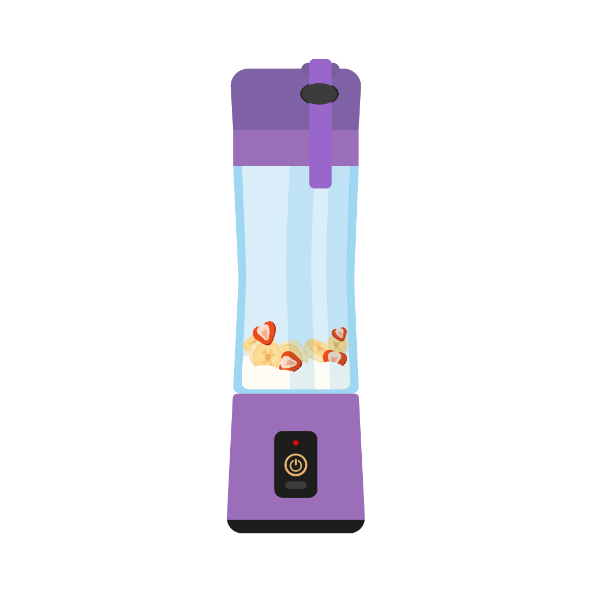

# Blender Simulator 🥤

Simulador interactivo de una licuadora en la web.

## 🔧 Funcionalidad
- Al hacer clic en el botón, la licuadora se enciende y emite sonido.
- Al volver a hacer clic, la licuadora se apaga.

## 🖼️ Capturas

## 🚀 Despliegue en GitHub Pages
1. Clonar el repositorio:
git clone https://github.com/tuusuario/blender-simulator.git

2. Abrir `index.html` en el navegador.

### 📌 Autor
Proyecto creado por QuesilloLover.
